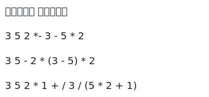

# 栈

栈是一种特殊的线性表，对于这钟线性表，规定它的插入运算和删除运算均在线性表的同一端进行，进行插入和删除的那一段称为栈顶，另一端称为栈底，不含任何数据元素的栈称为空栈。

栈的插入运算叫做进栈，也称压栈、入栈，它是把新元素放到栈顶元素的上面，使之成为新的栈顶元素；栈的删除运算叫做出栈，也称弹栈，它是把栈顶元素删除掉，使其相邻的元素成为新的栈顶元素。

栈的特点是先进后出，后进先出，简称为LIFO（Last In First Out）。

# 栈的图表解析


# 栈的类型定义
```c
#define MAXSIZE 100
typedef int DataType;
typedef struct {
    DataType data[MAXSIZE];
    int top;
} SeqStack;
```

# 栈的基本操作
```c
/**
 * 栈的初始化
 * @param S
 * @return void
 */
void InitStack(SeqStack *S) {
    S->top = 0;
}

/**
* 判断栈是否为空
 * @param S
 * @return 1: 空 0: 非空
*/
int IsEmpty(SeqStack *S) {
    return S->top == 0;
}

/**
* 读取栈顶元素
 * @param S
 * @return 栈顶元素
*/
DataType ReadTopStack(SeqStack *S) {
    if (IsEmpty(S)) {
        printf("栈空\n");
        return 0;
    }
    return S->data[S->top - 1];
}

/**
* 栈的插入操作
 * @param S
 * @param x
 * @return void
*/
void PushStack(SeqStack *S, DataType x) {
    if (S->top == MAXSIZE) {
        printf("栈满\n");
        exit(1);
    }
    S->data[S->top++] = x;
}

/**
* 栈的删除操作
 * @param S
 * @return void
*/
void PopStack(SeqStack *S) {
    if (IsEmpty(S)) {
        printf("栈空\n");
        exit(1);
    }
    // 为什么不把 S -> data[S->top] = 0; ?
    // 因为这样会导致栈顶元素被覆盖 0 了
    S->top--;
}

/**
* 打印栈中元素
 * @param S
 * @return void
*/
void PrintStack(SeqStack *S) {
    if (IsEmpty(S)) {
        printf("栈空\n");
        exit(1);
    }
    for (int i = 0; i < S->top; i++) {
        printf("%5d ", S->data[i]);
    }
}
```

# 栈的应用之一 —— 括号匹配

## 问题描述
给定一个字符串，其中包含三种括号，分别是小括号`()`、中括号`[]`和大括号`{}`，判断该字符串中的括号是否匹配。

## 问题分析
1. 从左到右扫描字符串，遇到左括号时，将其压入栈中；
2. 遇到右括号时，若栈为空，则说明右括号多于左括号，匹配失败，否则将栈顶元素弹出，与右括号进行匹配，若匹配失败，则说明左右括号不匹配，匹配失败，否则继续扫描字符串；
3. 当扫描完字符串时，若栈为空，则说明左右括号匹配，匹配成功，否则说明左括号多于右括号，匹配失败。
4. 若栈不为空，则说明左括号多于右括号，匹配失败。

## 图解



## 代码实现
```c
int IsInStack(SeqStack *S, char str) {
    if (!IsEmpty(S) && ReadTopStack(S) == str) {
        // 匹配到右大括号，栈顶元素为左大括号，出栈
        PopStack(S);
        return 1;
    }
    return 0;
}


/**
* 判断表达式中的括号是否匹配
 * @param {char} str[]
 * @return {int} 1: 匹配不成功 0: 匹配成功
*/
int Match(char str[]) {
    int i = 0;
    char c;
    SeqStack stack;
    // 初始化栈
    InitStack(&stack);

    while (str[i] != '#') {
        // 遍历字符串
        switch (str[i]) {
            case '(':
            case '[':
            case '{':
                // 匹配到左括号、左中括号、左大括号，入栈
                PushStack(&stack, str[i]);
                break;
            case '}':
            case ']':
            case ')':
                // 匹配到右括号、右中括号、右大括号，出栈
                c = str[i] == '}' ? '{' : str[i] == ']' ? '[' : '(';

                if(!IsInStack(&stack,c )){
                    return  1;
                }
                break;
        }
        i++;
    }

    // 如果栈为空就说明匹配成功
    return IsEmpty(&stack)  ? 0 : 1;
}

int main() {
    char str[] = "{[()]}#";
    printf("(1为匹配失败，0为匹配成功)匹配结果：%d\n", Match(str));
    return 0;
}
```

# 栈的应用之二 —— 表达式求值

## 问题描述
给定一个表达式，其中有 `+`、`-`、`*`、`/`、`()`等计算符号，求该表达式的值。

## 1、中缀表达式
中缀表达式是一种常用的一种表达式，中缀表达式的计算规则有：
- 括号内的操作先执行，括号外的操作后执行。如果有多层括号，先计算最内层的括号。
- 先乘除后加减。
- 在有多个乘除运算或加减运算时，先计算左边的运算。

中缀表达式就是我们平时常用的表达式，如 `1 + 2 * 3`、`(1 + 2) * 3`、`1 + 2 * (3 + 4)`等。

## 2、后缀表达式
后缀表达式中只有操作数和操作符，它不再包含有括号，操作符在两个操作数之后。它的计算规则非常简单，严格按照从左到右的顺序进行计算。

下面是几个后缀表达式及中缀表达式表示形式：


## 3、中缀表达式转后缀表达式图解


## 4、计算后缀表达式的值图解

